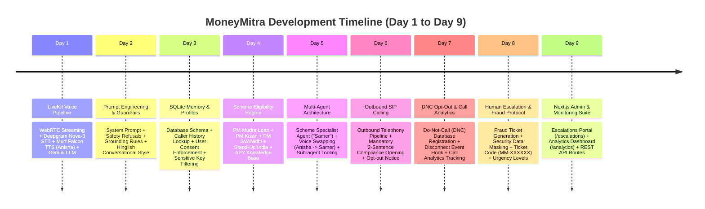
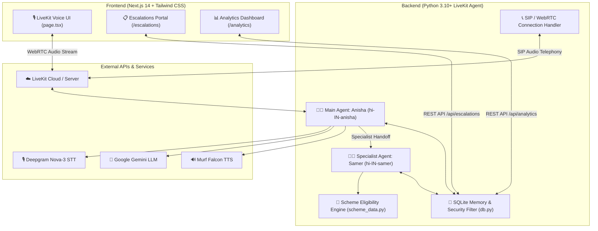

# 🎙️ MoneyMitra — Multilingual Voice AI Agent System (Day 1 to Day 9 Architecture)

**MoneyMitra** is an enterprise-grade, multilingual financial voice AI agent built with **LiveKit Agents SDK**, **Murf Falcon TTS** (ultra-low latency text-to-speech), **Deepgram Nova-3 STT**, **Google Gemini LLM**, **SQLite Persistent Memory**, and a **Next.js 14 Web UI & Admin Dashboard**.

This README provides a complete technical blueprint of everything built from **Day 1 to Day 9**, including architecture diagrams, code modules, database schemas, API routes, security guardrails, and running instructions.

---

## 📅 Day-by-Day Development Roadmap



---

## 🏗️ System Architecture



---

## 🚀 Detailed Day-by-Day Implementation Breakdown

### 🔹 Day 1: Base LiveKit Voice Agent & Real-Time Audio Pipeline
- **Goal**: Set up real-time streaming audio conversation between caller and voice AI.
- **Key Files**: [`backend/src/agent.py`](file:///c:/HTML%28CT%29/murf-livekit-starter/backend/src/agent.py)
- **Features & Implementation**:
  - Integrated **LiveKit Agents SDK** with WebRTC audio streaming.
  - **Speech-to-Text (STT)**: Deepgram Nova-3 multilingual model (`nova-3`, language=`multi`).
  - **Text-to-Speech (TTS)**: **Murf Falcon TTS** (`hi-IN-anisha` - female Indian Hindi-English voice).
  - **LLM**: Google Gemini (`gemini-3.5-flash-lite`).
  - **Voice Activity Detection (VAD)**: Silero VAD with noise cancellation (`BVCTelephony` / `BVC`).
  - Prewarming mechanism (`prewarm()`) to pre-load VAD models for low-latency startup.

---

### 🔹 Day 2: System Prompt & Safety/Grounding Guardrails
- **Goal**: Define MoneyMitra assistant persona, conversation boundaries, and strict safety guardrails.
- **Key Files**: [`backend/src/prompt.py`](file:///c:/HTML%28CT%29/murf-livekit-starter/backend/src/prompt.py), [`backend/tests/test_agent.py`](file:///c:/HTML%28CT%29/murf-livekit-starter/backend/tests/test_agent.py)
- **Features & Implementation**:
  - **Identity**: MoneyMitra female financial virtual assistant.
  - **Language & Tone**: Clear, empathetic, professional Hinglish (Hindi-English mix).
  - **Grounding Rule**: Refuses to guess caller personal information (e.g. birthplace, bank balance) if not present in verified database facts.
  - **Harmful Request Refusal**: Instantly rejects hacking attempts, illegal financial evasion, or unauthorized access.

---

### 🔹 Day 3: Persistent SQLite Memory & Caller Profile Management
- **Goal**: Store caller facts across sessions with explicit privacy and security rules.
- **Key Files**: [`backend/src/db.py`](file:///c:/HTML%28CT%29/murf-livekit-starter/backend/src/db.py), [`backend/src/agent.py`](file:///c:/HTML%28CT%29/murf-livekit-starter/backend/src/agent.py), [`backend/tests/test_memory.py`](file:///c:/HTML%28CT%29/murf-livekit-starter/backend/tests/test_memory.py)
- **Features & Implementation**:
  - SQLite database schema initialized at `backend/data/caller_memory.db`.
  - **`lookup_caller(search_term)` tool**: Retrieves language preference, last topic discussed, caller facts, and last interaction timestamp.
  - **`save_caller_info(...)` tool**: Saves caller details **ONLY if explicit user consent is granted** (`user_consent=True`).
  - **Financial Privacy Guardrail (`FORBIDDEN_FACT_KEYS`)**: Filters out sensitive keywords (OTPs, PINs, Passwords, PAN, Aadhaar, Card numbers, CVV) to prevent privacy leaks.

---

### 🔹 Day 4: Government Financial Scheme Knowledge Base & Rule Engine
- **Goal**: Provide accurate eligibility guidance and document checklists for major Indian government financial schemes.
- **Key Files**: [`backend/src/scheme_data.py`](file:///c:/HTML%28CT%29/murf-livekit-starter/backend/src/scheme_data.py), [`backend/tests/test_scheme_eligibility.py`](file:///c:/HTML%28CT%29/murf-livekit-starter/backend/tests/test_scheme_eligibility.py)
- **Features & Implementation**:
  - Real-time scheme evaluation engine with official policy rules as of **August 2026**:
    - **PM Mudra Loan**: Shishu (up to ₹50,000), Kishore (₹50,000 to ₹5 Lakh), Tarun (₹5 Lakh to ₹10 Lakh).
    - **PM Kisan Samman Nidhi**: ₹6,000/year income support for landholding farmer families.
    - **PM SVANidhi**: Collateral-free micro-credit for urban street vendors.
    - **Stand-Up India**: ₹10 Lakh to ₹1 Crore loans for SC/ST and Women entrepreneurs.
    - **Atal Pension Yojana (APY)**: Guaranteed minimum monthly pension (₹1,000 to ₹5,000) for ages 18–40.
  - Returns structured eligibility status (`QUALIFIED`, `NOT_ELIGIBLE`, `NEEDS_DOCUMENTS`), max loan tier, required document checklist, and official policy restrictions.

---

### 🔹 Day 5: Multi-Agent Architecture & Voice-Swapping Specialist ("Samer")
- **Goal**: Hand over complex scheme inquiries to a dedicated specialist sub-agent with a distinct voice persona.
- **Key Files**: [`backend/src/scheme_specialist.py`](file:///c:/HTML%28CT%29/murf-livekit-starter/backend/src/scheme_specialist.py), [`backend/src/agent.py`](file:///c:/HTML%28CT%29/murf-livekit-starter/backend/src/agent.py), [`backend/tests/test_scheme_specialist.py`](file:///c:/HTML%28CT%29/murf-livekit-starter/backend/tests/test_scheme_specialist.py)
- **Features & Implementation**:
  - Implemented `SchemeSpecialist` sub-agent extending `livekit.agents.Agent`.
  - **Dynamic Voice Swapping**: Seamlessly transitions from main voice ("Anisha" - female) to scheme specialist voice ("Samer" - `hi-IN-samer` male conversational voice).
  - **`transfer_to_scheme_specialist` tool**: Main agent transfers session state to Samer when detailed eligibility or document checklists are required.
  - **`check_scheme_eligibility` tool**: Specialist queries rule engine and speaks policy details out loud.

---

### 🔹 Day 6: Outbound SIP Calling & Regulatory Compliance Opening
- **Goal**: Enable automated outbound call campaigns via SIP telephony while adhering to telemarketing compliance rules.
- **Key Files**: [`backend/src/outbound_call.py`](file:///c:/HTML%28CT%29/murf-livekit-starter/backend/src/outbound_call.py), [`backend/src/agent.py`](file:///c:/HTML%28CT%29/murf-livekit-starter/backend/src/agent.py), [`backend/tests/test_outbound_opening.py`](file:///c:/HTML%28CT%29/murf-livekit-starter/backend/tests/test_outbound_opening.py)
- **Features & Implementation**:
  - SIP channel detection (`ParticipantKind.PARTICIPANT_KIND_SIP` or `outbound-*` room naming).
  - **Mandatory 2-Sentence Compliance Opening**:
    1. Identifies MoneyMitra business entity, recipient name, and deadline notice (e.g. PM Mudra Loan subsidy deadline 15 August 2026).
    2. Provides immediate, clear opt-out statement ("Agar aap aage se aisi reminder calls nahi chahte, toh aap abhi 'stop' bolein...").

---

### 🔹 Day 7: DNC Opt-Out System & Call Analytics Tracking
- **Goal**: Implement instant Do-Not-Call (DNC) registration and track call session outcomes.
- **Key Files**: [`backend/src/db.py`](file:///c:/HTML%28CT%29/murf-livekit-starter/backend/src/db.py), [`backend/src/agent.py`](file:///c:/HTML%28CT%29/murf-livekit-starter/backend/src/agent.py), [`backend/tests/test_opt_out.py`](file:///c:/HTML%28CT%29/murf-livekit-starter/backend/tests/test_opt_out.py)
- **Features & Implementation**:
  - **`opt_out_caller` tool**: Triggered immediately when caller mentions "stop", "opt out", "don't call me", or "remove my number".
  - Records `opted_out=True` in SQLite caller profile to exclude number from future outbound call triggers.
  - **Call Analytics Event Hook (`_on_disconnected`)**: Captures room disconnection events and logs call outcome (`SUCCESS` if objective achieved, `FAILED` otherwise) in `call_analytics` table.

---

### 🔹 Day 8: Human Escalation Protocol & Security Filtering
- **Goal**: Handle caller fraud reports, disputes, or complex requests by opening structured human support tickets.
- **Key Files**: [`backend/src/db.py`](file:///c:/HTML%28CT%29/murf-livekit-starter/backend/src/db.py), [`backend/src/agent.py`](file:///c:/HTML%28CT%29/murf-livekit-starter/backend/src/agent.py), [`backend/tests/test_escalation.py`](file:///c:/HTML%28CT%29/murf-livekit-starter/backend/tests/test_escalation.py)
- **Features & Implementation**:
  - **`create_escalation` tool**: Triggered when caller reports unauthorized transactions, fraud, or requires human decision-making.
  - **Consent Enforcement**: Strictly checks `user_consent=True` before storing escalation tickets.
  - **Sensitive Data Masking**: Automatically sanitizes summary fields to strip passwords, PINs, OTPs, and full bank account numbers.
  - **Ticket Code Generation**: Generates unique ticket codes (e.g. `MM-9A4F2C`) with urgency classification (`HIGH` for fraud, `NORMAL` for standard support).

---

### 🔹 Day 9: Next.js Admin Dashboards & Real-Time Monitoring API
- **Goal**: Build modern frontend portals for human operations agents and call center supervisors to monitor performance and handle escalations.
- **Key Files**:
  - [`frontend/app/escalations/page.tsx`](file:///c:/HTML%28CT%29/murf-livekit-starter/frontend/app/escalations/page.tsx)
  - [`frontend/app/analytics/page.tsx`](file:///c:/HTML%28CT%29/murf-livekit-starter/frontend/app/analytics/page.tsx)
  - [`frontend/app/api/escalations/route.ts`](file:///c:/HTML%28CT%29/murf-livekit-starter/frontend/app/api/escalations/route.ts)
  - [`frontend/app/api/analytics/route.ts`](file:///c:/HTML%28CT%29/murf-livekit-starter/frontend/app/api/analytics/route.ts)
- **Features & Implementation**:
  - **Human Escalations Dashboard (`/escalations`)**:
    - Real-time ticket management with urgency badges (`HIGH` red, `NORMAL` blue).
    - Filters by ticket status (`OPEN`, `IN_PROGRESS`, `RESOLVED`).
    - Ticket details modal showing incident breakdown, verified checks, caller preferred follow-up method, and resolution controls.
    - Full-text search and CSV report export.
  - **Analytics & Compliance Dashboard (`/analytics`)**:
    - High-level KPIs: Total Calls, Call Success Rate %, DNC Opt-Out Registrations, Open Escalation Tickets.
    - Interactive charts showing scheme inquiry distribution and call outcome ratios.
  - **REST API Endpoints**: Exposes SQLite database tables cleanly over JSON endpoints with status update capabilities (`PATCH /api/escalations`).

---

## 🗄️ Database Schemas (SQLite)

Located at `backend/data/caller_memory.db`:

### `caller_profiles`
| Column | Type | Description |
| :--- | :--- | :--- |
| `user_id` | `TEXT PRIMARY KEY` | Caller unique ID or name |
| `name` | `TEXT NOT NULL` | Caller display name |
| `language_preference` | `TEXT` | Preferred language (e.g. 'Hindi-English') |
| `facts` | `TEXT (JSON)` | Sanitized key-value facts & opt-out flag |
| `last_topic` | `TEXT` | Last financial scheme or query discussed |
| `last_interaction` | `TEXT (ISO8601)` | Timestamp of last call session |

### `human_escalations`
| Column | Type | Description |
| :--- | :--- | :--- |
| `id` | `INTEGER PRIMARY KEY` | Auto-incrementing internal ID |
| `ticket_code` | `TEXT UNIQUE` | Public ticket ID (e.g. `MM-4B8C1A`) |
| `user_id` | `TEXT NOT NULL` | Caller identifier |
| `caller_name` | `TEXT NOT NULL` | Name of caller |
| `reason_category` | `TEXT NOT NULL` | e.g. 'Fraud/Security Incident' |
| `what_happened` | `TEXT NOT NULL` | Incident summary (sanitized) |
| `what_agent_checked` | `TEXT` | Steps completed by agent prior to escalation |
| `urgency` | `TEXT` | `HIGH` or `NORMAL` |
| `language` | `TEXT` | Preferred language |
| `preferred_followup` | `TEXT` | Preferred contact method (Phone / SMS / Email) |
| `status` | `TEXT` | `OPEN`, `IN_PROGRESS`, or `RESOLVED` |
| `created_at` | `TEXT (ISO8601)` | Ticket creation timestamp |

### `call_analytics`
| Column | Type | Description |
| :--- | :--- | :--- |
| `id` | `INTEGER PRIMARY KEY` | Log entry ID |
| `caller_id` | `TEXT` | Associated caller identifier |
| `outcome` | `TEXT NOT NULL` | `SUCCESS` or `FAILED` |
| `timestamp` | `TEXT (ISO8601)` | Session end timestamp |

---

## 🛠️ Tech Stack Overview

| Layer | Technology Used |
| :--- | :--- |
| **Voice Transport** | LiveKit Cloud / WebRTC & SIP Telephony |
| **Speech-to-Text (STT)** | Deepgram Nova-3 (`multilingual`) |
| **Text-to-Speech (TTS)** | Murf Falcon (`hi-IN-anisha` & `hi-IN-samer`) |
| **LLM Engine** | Google Gemini (`gemini-3.5-flash-lite`) |
| **Voice Activity Detection** | Silero VAD + LiveKit Turn Detector |
| **Backend Framework** | Python 3.10+ with `uv` package manager & `livekit-agents` SDK |
| **Database** | SQLite3 |
| **Frontend UI** | Next.js 14 (App Router), React, TypeScript, Tailwind CSS, Shadcn UI |
| **Testing** | pytest with LiveKit Agent Testing Framework (LLM-as-judge) |

---

## 🧪 Testing Suite

Tests are located in `backend/tests/`:

```bash
cd backend
uv run pytest
```

### Test Coverage Summary:
- [`test_agent.py`](file:///c:/HTML%28CT%29/murf-livekit-starter/backend/tests/test_agent.py): Evaluates friendliness, grounding refusal, and harmful request blocking.
- [`test_memory.py`](file:///c:/HTML%28CT%29/murf-livekit-starter/backend/tests/test_memory.py): Validates SQLite caller lookup and consent-gated saving.
- [`test_scheme_eligibility.py`](file:///c:/HTML%28CT%29/murf-livekit-starter/backend/tests/test_scheme_eligibility.py): Verifies accuracy of PM Mudra, PM Kisan, and APY eligibility rules.
- [`test_scheme_specialist.py`](file:///c:/HTML%28CT%29/murf-livekit-starter/backend/tests/test_scheme_specialist.py): Tests multi-agent handoff to Samer and voice instance setup.
- [`test_outbound_opening.py`](file:///c:/HTML%28CT%29/murf-livekit-starter/backend/tests/test_outbound_opening.py): Tests 2-sentence compliance opening and DNC notice delivery.
- [`test_opt_out.py`](file:///c:/HTML%28CT%29/murf-livekit-starter/backend/tests/test_opt_out.py): Tests instant opt-out registration and DNC profile updates.
- [`test_escalation.py`](file:///c:/HTML%28CT%29/murf-livekit-starter/backend/tests/test_escalation.py): Tests ticket generation, consent checking, and sensitive data sanitization.

---

## ⚡ Running the Application

### 1. Prerequisites
- Python 3.10+ and [`uv`](https://docs.astral.sh/uv/) installed.
- Node.js 18+ and `pnpm` installed.
- LiveKit Cloud account & credentials (`LIVEKIT_URL`, `LIVEKIT_API_KEY`, `LIVEKIT_API_SECRET`).
- `MURF_API_KEY`, `DEEPGRAM_API_KEY`, `GOOGLE_API_KEY` set in `backend/.env.local`.

### 2. Quickstart Script

**On Windows (PowerShell):**
```powershell
.\start_app.ps1
```

**On macOS/Linux:**
```bash
chmod +x start_app.sh
./start_app.sh
```

### 3. Manual Startup (Separate Terminals)

**Terminal 1 — Local LiveKit Server (Optional if using LiveKit Cloud):**
```bash
livekit-server --dev
```

**Terminal 2 — Python Voice Backend:**
```bash
cd backend
uv sync
uv run python src/agent.py dev
```

**Terminal 3 — Next.js Web UI & Dashboards:**
```bash
cd frontend
pnpm install
pnpm dev
```

Open your browser at:
- **Voice Agent UI**: [http://localhost:3000](http://localhost:3000)
- **Human Escalations Portal**: [http://localhost:3000/escalations](http://localhost:3000/escalations)
- **Analytics Dashboard**: [http://localhost:3000/analytics](http://localhost:3000/analytics)

---

## 📜 License
MIT License. Created with Murf Falcon TTS & LiveKit Agents SDK.
